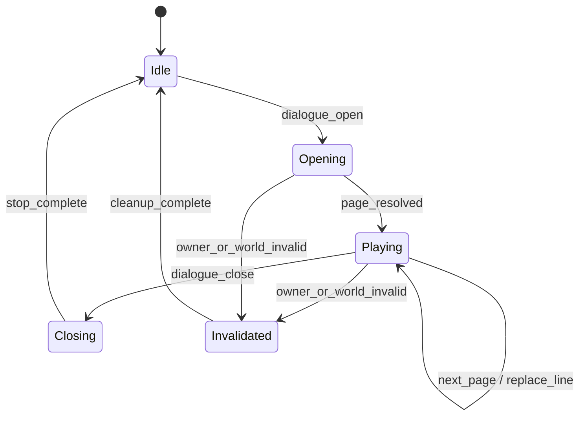

# Runtime Architecture

## Current Boundary

The current prototype maps Palworld's interaction-driven human dialogue interface to a future authored-voice playback manager.

The tested interaction creates:

- `WBP_TalkWindow_C`: conversation state, text-list progression, input, and hiding.
- `WBP_Talk_C`: visible speaker name, main text, next-page indicator, and open/close animation events.

The diagnostic source registers hooks only after a conversation is visible and the operator presses `F8`. It logs calls and safely inspects parameters; it does not play audio or change widget, game, or save state.

### Lifecycle targets

- `WBP_Talk_C:AnmEvent_Open`
- `WBP_Talk_C:AnmEvent_Close_WithEventDispatcher`
- `WBP_TalkWindow_C:SetHide`

### Identity and content targets

- `WBP_Talk_C:SetTalkerName`
- `WBP_Talk_C:SetMainText`
- `WBP_TalkWindow_C:SetTextList`
- `WBP_TalkWindow_C:SetupNextText`
- `WBP_TalkWindow_C:SetupNextSplittedText`

### Input and presentation targets

- `WBP_TalkWindow_C:OnProgressTextInput`
- `WBP_TalkWindow_C:ProgressText`
- `WBP_Talk_C:SetNextArrowVisible`

## Rejected Hook Surface

An earlier controlled probe registered:

- `ExecuteUbergraph_WBP_TalkWindow`
- `ExecuteUbergraph_WBP_Talk`

Registration, tracing, and teardown succeeded, but the graph surface routed Tick through the same callback:

| Measurement | Result |
|---|---:|
| Total callbacks | 19,747 |
| Tick-associated callbacks | 19,731 |
| Useful non-Tick callbacks | 16 |

The graph surface was rejected because it adds unnecessary callback pressure and obscures the low-frequency dialogue events required by playback logic.

## Authored-Dialogue State Model



Each UI callback should be normalized immediately into a plain event record:

```text
DialogueEvent
  session_id
  speaker_id
  speaker_display_name
  line_id
  subtitle_text
  page_index
  event_type
  world_timestamp
  owning_actor_id
```

Transient widget objects must not become long-lived playback state. The runtime should retain stable primitive identities and reacquire Unreal objects only when an operation requires them.

## Playback Manager Responsibilities

- Resolve a stable line ID to an audio asset.
- Start one voice instance owned by the active speaker and session.
- Replace or queue speech on page progression according to policy.
- Stop or briefly fade speech when the conversation closes.
- Reject duplicate starts for the same session and line.
- Prevent stale playback after rapid close and reopen.
- Apply per-speaker priority, concurrency, and cooldown rules.
- Apply spatial position, attenuation, and dialogue mix behavior.
- Release all runtime references on conversation close, actor invalidation, or world exit.

## Line Data

Recommended identifier:

`VO_<Language>_<Faction>_<Speaker>_<Event>_<Intent>_<Variation>`

Each line record should include:

- Subtitle and speaker identity.
- Event and performance intent.
- Priority, interruption policy, cooldown, and selection weight.
- Performer, rights status, and recording revision.
- Dry master and runtime asset paths.
- Localization, implementation, test-build, and approval state.

## Reliability Requirements

Every production hook must have:

- Stored pre-hook and post-hook identifiers.
- Deterministic unregistration.
- Protected parameter conversion.
- No persistent transient-widget reference.
- Explicit cleanup on conversation close, owner invalidation, and world exit.

Validation order:

1. Single-player client.
2. Listen host with one remote client.
3. Dedicated server with one modded client.
4. Dedicated server with multiple modded clients.

